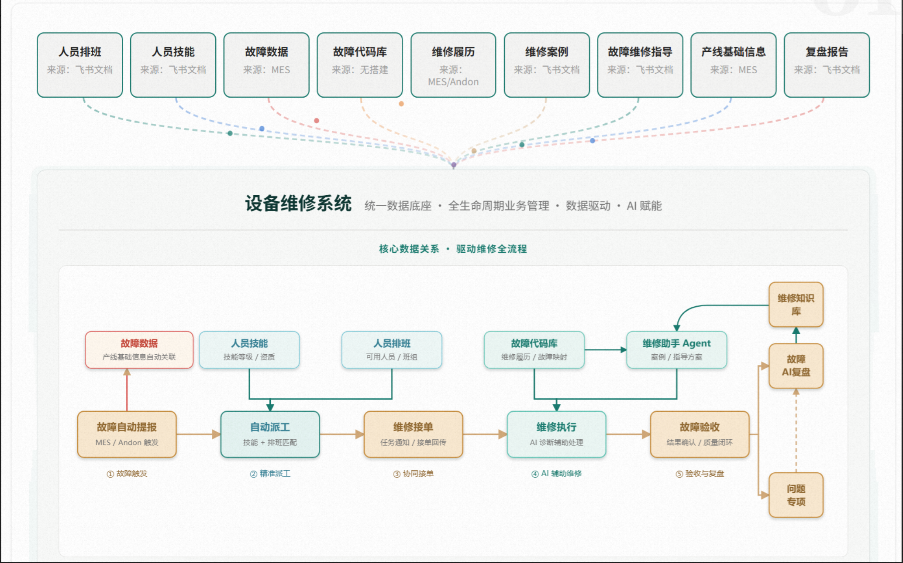
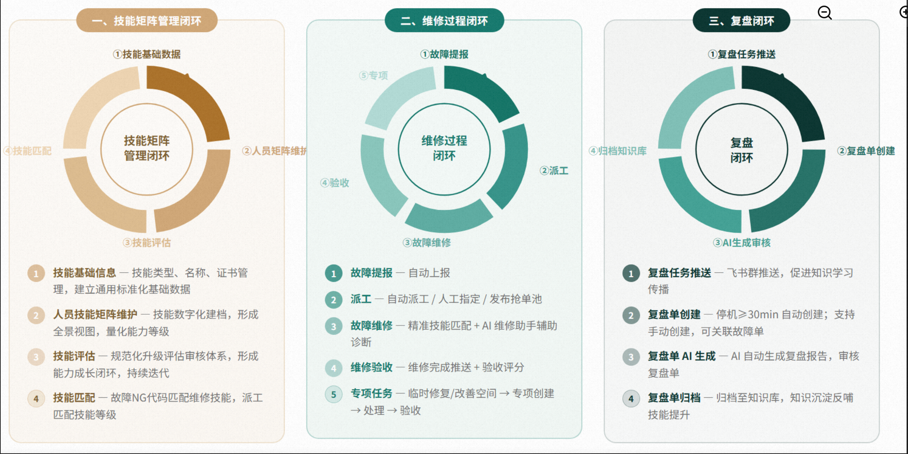
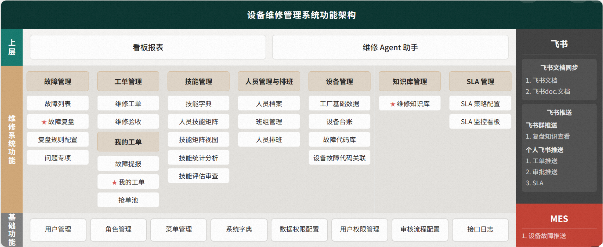
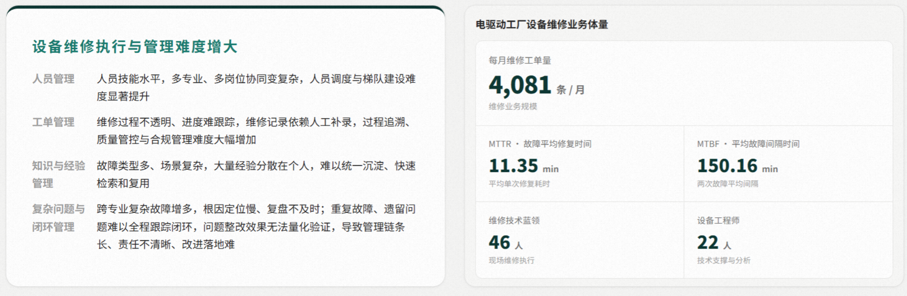
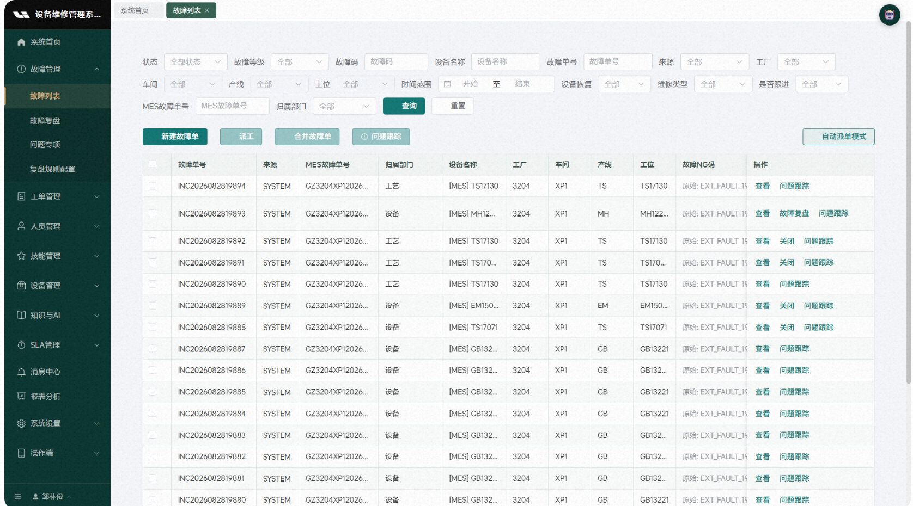
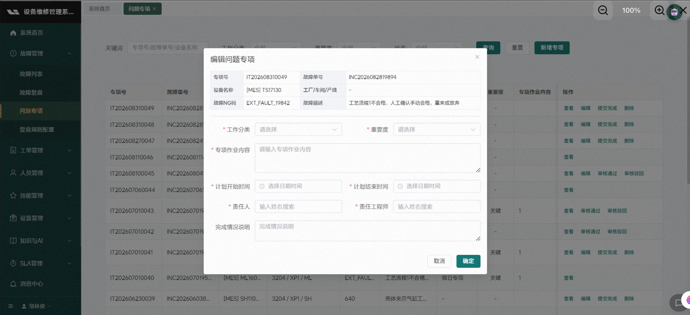
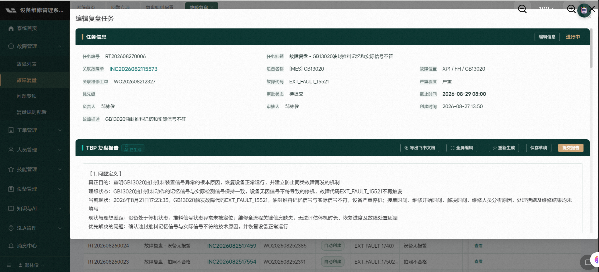

# 04-04 · 案例分析：设备维修全生命周期管理系统

> 讨论稿 / 会更新 · 最近更新 2026-09-23
>
> **一句话结论**：这个案例的价值不在于“做了一个 AI 诊断助手”，而在于它围绕设备维修这个高价值业务场景，把故障、工单、人员、知识、复盘、SLA 和 AI 诊断串成了任务闭环，是 AI Native 组织转型从“工具使用”走向“任务流重构”的典型早期样本。
>
> 说明：本文基于用户提供的理想 AI FOR ME 社区案例摘录整理，原帖链接：<https://aiforme.lixiang.com/forum/posts/FL2094349484691746816>。网页正文未能通过公开 HTML 直接抓取，具体判断以用户提供内容为依据。

---

## 0. 案例概览

案例名称：**制造-电驱动工厂设备维修全生命周期管理系统**

项目方向：围绕电驱动工厂设备维修场景，打通维修全生命周期信息孤岛，实现：

```text
故障报修
→ 工单派发
→ 维修处理
→ AI 诊断辅助
→ 问题专项跟踪
→ 维修复盘
→ 知识沉淀
→ 技能矩阵
→ SLA 异常上报
→ 管理分析
```

案例中的核心表述是：

> 基于设备维修场景，打通维修全生命周期各环节信息孤岛，实现故障报修、工单派发、维修处理、知识沉淀到复盘分析的全流程闭环。以「AI 诊断助手」为核心，实现数智化闭环管理，为设备管理决策提供精准数据支撑。

项目目标可以概括成四件事：

1. **破孤岛、通数据**：汇聚设备全业务数据源，统一数据底座，实现维修全流程追溯。
2. **沉知识、可复用**：沉淀维修案例与故障经验，形成标准化故障知识库，替代零散人工经验。
3. **提效率、强协同**：通过 AI 诊断赋能维修作业，实现工单、人员、任务高效协同。
4. **转模式、智管理**：从人工经验驱动，升级为数据量化、智能决策、闭环可控的设备维修管理。

系统图里可以更直观看到这个设计思路：上层汇聚人员排班、人员技能、故障数据、故障代码库、维修履历、维修案例、故障维修指导、产线基础信息和复盘报告等多类数据；中层以设备维修系统作为统一数据底座；下层把“故障自动提报 → 自动派工 → 维修接单 → 维修执行 → 故障验收 → 复盘 / 专项 / 知识库”组织成可闭环的维修任务流。



这张图尤其说明：案例的重点不是单独做一个“维修助手 Agent”，而是把维修助手 Agent 放在故障代码库、维修案例、维修知识库、AI 复盘和问题专项之间，让 AI 参与完整任务链条中的诊断、执行、验收、复盘和知识沉淀。

从功能架构看，系统不是只有故障列表，而是覆盖故障管理、工单管理、技能管理、人员与排班、设备管理、知识库管理、SLA 管理和基础权限配置；右侧还明确接入飞书文档 / 群推送 / 个人推送，以及 MES 的设备故障推送。这说明它已经具备“业务系统 + 协同系统 + 知识系统 + 外部数据源”的集成雏形。



---

## 1. 为什么这个场景适合做 AI Native 组织转型

设备维修不是边缘场景，而是制造业里非常典型的高价值黑洞场景。

它同时具备几个特征：

| 特征 | 说明 |
|---|---|
| 高频 | 设备多、自动化率高，故障和维修任务持续发生 |
| 高损失 | 瓶颈设备停机 1 小时可能影响整条产线 |
| 高经验依赖 | 老师傅经验决定诊断效率和维修质量 |
| 高知识沉淀价值 | 故障案例、SOP、复盘、视频、维修履历都能复用 |
| 高协同复杂度 | 维修、产线、设备、工艺、质量、管理层都有关联 |
| 高闭环价值 | 从故障响应到根因改善，再到源头预防，可以持续优化 |

所以这个案例不是“为了 AI 找场景”，而是业务本身就有强烈的 AI Native 改造价值。

很多企业 AI 案例的问题是场景太轻，例如：

它不是停留在 AI 写周报、总结会议、生成 PPT、写宣传文案这类外围办公场景。

这些当然有价值，但离经营结果远。

设备维修天然可以接到：

真正被牵引的是停机时间、MTTR、MTBF、OEE、维修成本、产线损失、人员技能、故障复发率和专项问题闭环率。

这些是真正的经营指标。

项目材料里的业务体量也能支撑这一判断：电驱动工厂每月维修工单量达到 4,081 条，材料中还展示了 MTTR、MTBF、维修技术蓝领和设备工程师等基础运营指标。这说明它不是低频展示型 demo，而是有足够任务密度、人员协同复杂度和经营指标牵引的真实业务流。



---

## 2. 它体现出的 AI Native 组织特征

在 `04-02` 里，AI Native 组织不是“用了 AI 工具”，而是：

```text
经营结果
→ 业务对象
→ 任务流
→ 人机协同
→ 执行留痕
→ 结果归因
→ 反馈学习
→ 组织激励
```

这个案例已经做到了前面几层。

### 2.1 它不是单点工具，而是在重构维修任务流

案例覆盖了：

```text
故障报修
→ 自动生成故障单
→ 自动派发责任人
→ 技术员接单处理
→ AI 诊断助手 / 数据库匹配解决方案
→ 一键采用方案并带入处理记录
→ 问题专项任务维护
→ 基于停机时间自动生成复盘任务
→ AI 复盘与审批
→ 自动发送学习培训群
→ 知识库 / 知识图谱沉淀
→ SLA 超时预警和层级上报
```

这说明它已经不是简单的“AI 维修问答助手”，而是在重塑完整任务流。

系统截图里的故障列表页也能体现这一点：故障不再只是 MES 里的一条报警记录，而是带有状态、故障等级、故障码、设备名称、来源、工厂 / 车间 / 产线 / 工位、维修类型、是否跟进等维度，并且可以直接进入查看、关闭、故障复盘和问题跟踪。



尤其值得注意的是，项目明确形成三大闭环：

这三条分别是技能矩阵管理闭环、维修闭环和复盘闭环。

这已经接近 AI Native 组织里的“任务操作系统”。

### 2.2 它有明确的业务对象建模

这个系统不是散乱地存文档，而是围绕设备维修的关键业务对象组织数据：

- 设备；
- 故障单；
- 维修工单；
- 故障类型；
- 维修案例；
- SOP；
- 复盘记录；
- 维修人员；
- 技能矩阵；
- 专项问题；
- SLA 异常。

AI 真正能进入业务，不是靠“知识库里有很多文档”，而是要有业务对象。

例如：

```text
某台设备
→ 发生某类故障
→ 生成某张工单
→ 由某个技能等级的人处理
→ 采用某个维修方案
→ 实际停机多久
→ 是否复发
→ 是否进入复盘
→ 是否沉淀为知识
```

这个链条一旦打通，AI 才能从“问答”进入“维修决策”。

### 2.3 它把知识沉淀嵌入流程，而不是另建孤立知识库

案例提到：

> 通过定时轮询的方式将设备维修系统中的案例库、故障库、维修履历、SOP、复盘记录等信息同步至 Liwork，形成知识图谱。并在 Liwork 中搭建知识 Skill 实现维修问题的查询检索。

这个方向非常对。

传统知识库的问题是：

```text
维修人员干完活
→ 写不写复盘靠自觉
→ 文档放在飞书 / 文件夹
→ 下次故障没人搜
→ 老师傅经验还是留在脑子里
```

而这个系统把知识沉淀嵌入维修闭环：

```text
故障处理
→ 工单记录
→ 复盘任务
→ AI 复盘
→ 审批
→ 自动发送学习群
→ 同步知识图谱
→ 未来诊断可检索
```

这就比普通知识管理强很多。

### 2.4 它开始把老师傅经验转成组织资产

案例明确指出：

> 设备维修高度依赖老师傅经验，同类故障处理时间差异极大，老员工离职即带走核心维修经验。

这是制造组织最典型的隐性经验问题。

AI Native 组织转型最核心的事情之一，就是把：

```text
个人经验
→ 结构化知识
→ 标准任务流程
→ 可调用 Skill
→ 可复用组织能力
```

这个系统已经在做这件事。

尤其是：

- 维修案例库；
- 故障库；
- SOP；
- 视频图片；
- 复盘报告；
- 知识图谱；
- AI 诊断助手；
- 技能矩阵。

这些都是把个人经验变成组织资产的基础设施。

### 2.5 技能矩阵与故障任务关联，是一个很好的组织设计点

很多 AI 维修系统只关注“AI 怎么诊断”，但忽略“谁来修”。

这个案例里有：

系统已经把人员技能矩阵管理、故障与技能矩阵匹配、技能提升审批放在同一条能力链里。

这非常接近组织能力建设。

设备维修不是纯知识问题，还涉及：

- 谁有资格修；
- 谁更擅长某类设备；
- 谁需要培训；
- 谁能处理高风险故障；
- 某类故障是不是过度依赖某个老师傅；
- 技能结构是否支撑柔性生产。

如果继续做下去，它可以变成：

```text
故障类型
→ 所需技能
→ 当前人员能力
→ 派工策略
→ 维修结果
→ 技能成长
→ 培训计划
```

这就是 AI Native 组织的能力闭环。

案例中的闭环设计可以被拆成三条：

1. **技能矩阵管理闭环**：技能基础数据 → 人员技能矩阵维护 → 技能评估 → 技能匹配。
2. **维修过程闭环**：故障提报 → 派工 → 故障维修 → 维修验收 → 专项任务。
3. **复盘闭环**：复盘任务推送 → 复盘单创建 → AI 生成审核 → 复盘单归档。



这三条闭环非常关键：技能矩阵解决“谁能修”，维修过程解决“怎么修”，复盘闭环解决“怎么把这次维修变成下一次可复用的组织知识”。

---

## 3. 主要优点

### 3.1 从信息孤岛走向全流程闭环

它最基本但也最重要的价值，是把原来分散在 MES、飞书、文档、视频、人工经验里的数据，统一接到一个维修生命周期流程里。

原来可能是：

原来的状态是 MES 有故障、飞书有沟通、文档有 SOP、老师傅有经验、Excel 有记录、会议里有复盘，但这些信息没有形成统一任务闭环。

现在变成：

```text
统一维修系统
→ 故障单
→ 工单
→ 处理记录
→ AI 诊断
→ 复盘
→ 知识库
→ 技能矩阵
→ 管理分析
```

没有这一步，AI 很难真正发挥作用。

### 3.2 不是只做 AI 问答，而是嵌进工单处理

案例提到：

> 处理中可以借助 AI 诊断助手或者数据库自动匹配解决方案进行参考，点击采用方案后一键带入，减少人员填写的工作量。

这点很好。

因为 AI 如果只是在另一个页面问答，用户要自己复制、整理、回填，很容易不用。

更好的方式就是嵌入工作流：

```text
维修人员处理工单时
→ 系统自动关联设备 / 故障类型
→ AI 推荐方案
→ 人点击采用
→ 自动带入处理记录
→ 后续进入复盘和知识沉淀
```

这才是真正的 AI in workflow，而不是 AI as chatbot。

### 3.3 复盘任务自动生成，非常关键

复盘是设备维修知识沉淀的核心环节，但现实里最容易被忽略。

案例里提到：

> 支持基于规则（停机时间）自动生成复盘任务。

这非常好。

因为它把复盘从“靠自觉”变成“由规则触发”：

```text
停机超过阈值
→ 自动生成复盘任务
→ AI 辅助复盘
→ 审批通过
→ 自动发送学习群
→ 同步知识库
```

这就是知识闭环。

从系统界面看，“问题专项”不是一个简单备注字段，而是关联故障单、设备名称、故障 NG 码、故障描述、工作分类、重要度、专项作业内容、计划开始 / 结束时间、责任人、责任工程师和完成情况的结构化对象。这个设计很重要，因为它把一次维修事件中无法当场关闭的问题，转成了后续可跟踪、可分派、可验收的专项改进任务。



复盘任务本身也已经开始引入 AI 生成：界面中可以看到 TBP 复盘报告标注为“AI 已生成”，并支持重新生成、保存草稿、提交报告和导出飞书文档。这个产品细节说明 AI 不只是提供诊断建议，也开始进入组织知识生产流程。



### 3.4 SLA 异常层级上报强化了组织执行力

维修不是单纯技术问题，也是组织协同问题。

SLA 异常层级上报说明系统在管控：

- 任务是否超时；
- 谁没有响应；
- 哪个层级需要介入；
- 是否影响产线；
- 是否需要升级处理。

这让 AI 系统不只是“给建议”，而是参与组织执行节奏。

### 3.5 知识图谱 + Skill 的方向正确

维修问题往往不是简单关键词搜索，而是关系问题：

```text
设备型号
→ 故障类型
→ 历史案例
→ 维修方法
→ 备件
→ 技能要求
→ 复发情况
→ 关联工艺
→ 关联产线
```

用知识图谱组织这些关系，比普通文档搜索更适合维修诊断。

---

## 4. 主要不足和风险

### 4.1 经营结果量化还不够明确

案例说了“降本增效”“快速恢复、根因改善、源头预防”，但从材料看，经营指标还没有被充分展开。

我希望看到更明确的指标：

| 层级 | 指标 |
|---|---|
| 响应效率 | 平均响应时间、接单时间、派工时间 |
| 维修效率 | MTTR 平均维修时长、一次修复率 |
| 设备可靠性 | MTBF 平均故障间隔、故障复发率 |
| 产线影响 | 停机总时长、瓶颈设备停机损失 |
| 质量影响 | 因设备故障导致的不良率、返工率 |
| 成本影响 | 维修工时成本、备件成本、外协成本 |
| 知识复用 | AI 推荐采纳率、案例复用率 |
| 技能成长 | 多能工覆盖率、关键设备技能覆盖率 |
| 管理闭环 | 复盘完成率、专项关闭率、SLA 超时率 |

现在案例已经证明：

> 流程更完整了，管理更系统了。

但下一步还需要证明：

> 到底减少了多少停机？节省了多少钱？提升了多少 OEE？减少了多少复发？AI 贡献了其中多少？

### 4.2 AI 诊断助手的能力边界还不清楚

材料里提到 AI 诊断助手，但还不清楚它到底做到哪一层。

可以把 AI 维修诊断分成五层：

```text
L1 检索型：根据故障描述检索历史案例 / SOP
L2 推荐型：根据设备、故障类型、历史案例推荐方案
L3 推理型：结合传感器、报警、维修履历推断根因
L4 决策型：推荐维修路径、备件、人员、优先级
L5 闭环优化型：根据维修结果持续调整诊断模型和派工策略
```

从当前描述看，它可能主要在 L1-L2：

```text
AI 诊断助手
+ 数据库自动匹配解决方案
+ 一键带入
```

这是好的起点，但还不能过度称为“智能维修决策”。

如果要更 AI Native，需要继续回答：

- AI 推荐方案的准确率是多少？
- 推荐被采用率是多少？
- 采用 AI 推荐后 MTTR 是否下降？
- AI 错误推荐如何记录？
- 人工修改是否回流训练？
- 哪些故障类型适合 AI，哪些必须专家处理？
- AI 输出是否有置信度和风险提示？
- 是否区分“历史相似案例”和“推理生成建议”？

否则 AI 诊断助手容易停留在“智能搜索 + 文本生成”。

### 4.3 从维修响应到预测性维护还没有充分展开

这个系统目前重点是：

```text
故障发生后
→ 报修
→ 派工
→ 维修
→ 复盘
→ 知识沉淀
```

这是非常重要的闭环，但仍然偏“事后维修”和“事中响应”。

设备维修更高阶的目标应该是：

```text
事后维修
→ 事中响应
→ 事前预警
→ 预测性维护
→ 可靠性工程优化
```

未来可以进一步发展：

- 基于故障履历预测高风险设备；
- 基于报警序列识别故障前兆；
- 基于 MTBF 预测保养周期；
- 基于备件消耗预测库存；
- 基于设备状态推荐预防性点检；
- 基于复发故障推动设计、工艺、供应商改善。

真正的源头预防要接到：

后续可以继续接入 FMEA、RCM、TPM、设备健康评分、点检保养计划、备件策略和工艺参数优化。

这会让系统从维修管理升级为设备可靠性运营系统。

### 4.4 知识库治理机制需要强化

系统把飞书文档、视频图片、案例、SOP、复盘记录同步到 Liwork，形成知识图谱。这很好。

但知识库最大的风险是质量治理。

需要明确：

```text
哪些知识是官方有效版本？
哪些是历史案例，仅供参考？
哪些 SOP 已过期？
某条维修经验适用于哪些设备型号？
适用于哪个软件 / 硬件版本？
是否经过专家审核？
是否有风险等级？
是否曾导致错误维修？
是否需要定期复审？
```

否则知识越积越多，AI 检索时可能会把过期经验、个别经验、错误经验一起拿出来。

对维修场景来说，这很危险。

### 4.5 技能矩阵还可以进一步变成智能派工

目前案例里有技能矩阵管理，支持技能提升审批，也支持故障与技能矩阵匹配。

这是很好的基础。

但下一步可以更进一步：

```text
故障类型
+ 设备重要度
+ 当前 SLA
+ 人员技能
+ 人员位置
+ 当前负载
+ 历史维修成功率
+ 是否需要带教
+ 是否高风险
→ 自动推荐派工方案
```

这样系统就不只是记录技能，而是用技能矩阵优化组织资源调度。

### 4.6 还没有看到智力资产贡献和激励机制

这个案例已经在做知识沉淀，但还没有看到“谁贡献了这些知识资产、如何激励”的机制。

例如：

- 哪位技术员贡献了高复用维修案例？
- 哪个班组沉淀了优秀 SOP？
- 哪个复盘报告被大量复用？
- 哪个 AI Skill 背后是哪个专家的经验？
- 某个知识资产减少了多少停机？
- 是否给贡献人荣誉、积分、奖金或晋升加分？

如果没有激励，长期会出现一个问题：

```text
大家愿意用知识库，
但不一定愿意高质量地贡献知识库。
```

真正 AI Native 的组织应该让员工看到：

> 我把经验沉淀出来，不是被组织“榨干”，而是会变成我的可见贡献和长期收益。

这就是 `04-03` 说的“企业内智力封装与分成模式”。

### 4.7 还没有完全接入经营 AI 账本

设备维修最终要影响的是经营结果：

```text
停机减少
→ 产能损失减少
→ 订单交付改善
→ 质量损失减少
→ 维修成本降低
→ OEE 提升
→ 单位制造成本下降
```

系统下一步应该把维修指标和经营指标打通。

例如：

```text
某设备停机 60 分钟
× 该产线小时产能
× 产品贡献毛利
= 估算停机损失

某类故障复发率下降
× 历史平均停机损失
= 预防收益

某个 AI 推荐方案缩短维修 30 分钟
× 产线小时损失
= AI 辅助诊断收益
```

否则系统可以证明“维修流程更规范”，但很难证明“AI 创造了多少经营价值”。

这就是从数字化系统走向经营 AI 账本的关键。

---

## 5. 成熟度判断

我会把制造业 AI 维修系统分成五个阶段：

```text
L1 信息化：记录设备、故障、维修工单
L2 流程化：报修、派工、处理、复盘、SLA 闭环
L3 知识化：案例、SOP、故障库、知识图谱、AI 检索
L4 智能化：AI 诊断、智能派工、预测性维护、根因分析
L5 经营化：停机损失、OEE、维修成本、技能资产、知识贡献全部进入经营归因
```

这个案例目前可以判断在：

```text
L2.5 - L3.5 之间
```

也就是：

- 流程闭环已经比较完整；
- 知识沉淀方向明确；
- AI 诊断已经嵌入；
- 但预测性维护、经营归因、资产分成还没有完全展开。

如果继续往下做，很有潜力进入 L4-L5。

---

## 6. 建议的下一步升级方向

### 6.1 建立设备维修经营账本

把维修系统从“任务系统”升级成“经营归因系统”。

新增一层：

```text
设备维修经营账本
├── 停机损失账
├── 维修成本账
├── 备件消耗账
├── 故障复发账
├── AI 诊断收益账
├── 技能能力账
└── 知识资产贡献账
```

核心指标包括：

- 停机时间；
- 停机损失金额；
- MTTR；
- MTBF；
- OEE 影响；
- 维修工时；
- 备件成本；
- 外协成本；
- 故障复发率；
- AI 推荐采纳率；
- AI 推荐节省时间；
- 复盘知识复用次数。

这样才能从“管理更顺了”走向“经营价值算清了”。

### 6.2 把 AI 诊断助手升级为可评价的诊断系统

应该记录每次 AI 诊断的效果：

```text
故障单 ID
→ AI 推荐方案
→ 推荐依据
→ 置信度
→ 技术员是否采用
→ 是否修改
→ 实际处理结果
→ 是否一次修复
→ 是否复发
→ 实际停机时长
→ 技术员评价
```

然后沉淀 AI 诊断指标：

- 推荐命中率；
- 推荐采纳率；
- 一次修复率；
- 平均节省时长；
- 错误推荐率；
- 高风险故障人工拦截率；
- 不同故障类型下的 AI 表现。

这样 AI 才能被管理。

### 6.3 从复盘闭环升级为故障模式库 / FMEA

维修复盘不能只生成报告。

更高阶的是沉淀故障模式：

```text
故障现象
→ 故障原因
→ 影响后果
→ 检测方式
→ 处置措施
→ 预防措施
→ 复发概率
→ 风险等级
→ 适用设备
→ 关联备件
→ 关联技能
```

这接近 FMEA / RCM 的思路。

如果做到这一步，系统就可以从“快速修”走向“提前防”。

### 6.4 把技能矩阵升级为人员能力运营

技能矩阵不要只做统计和审批。

可以进一步接入：

```text
故障任务表现
→ 技能能力评估
→ 培训推荐
→ 带教安排
→ 晋升依据
→ 班组能力风险
```

例如：

- 某类故障只有 2 人会修，提示单点风险；
- 某新人连续处理低风险故障成功，推荐技能升级；
- 某老师傅的处理过程被 AI 总结为标准 SOP；
- 某班组在某类设备上的 MTTR 明显高于其他班组，触发培训任务。

这会让系统变成组织能力管理工具。

### 6.5 建立维修知识资产贡献机制

可以把知识资产分为：

可沉淀的资产包括维修案例、SOP、故障模式、视频教程、AI Prompt、诊断 Skill、复盘模板、点检规则和派工规则。

然后记录：

- 谁创建；
- 谁审核；
- 谁维护；
- 被哪些工单调用；
- 是否被采纳；
- 节省了多少维修时间；
- 是否减少故障复发；
- 是否被跨产线复用。

再建立贡献激励：

激励方式可以包括知识资产积分、专家认证、班组荣誉、创新奖金、内部 Skill 分成和晋升材料。

这会激发老师傅和一线技术员沉淀经验的动力。

---

## 7. 放回 04 系列里的位置

这篇案例正好可以把 `04` 到 `04-03` 的理论链条落到制造现场。

```text
04：AI 结果付费难，根因是价值归因难。

04-01：要先建经营 AI 账本，才能把结果、动因、措施和责任接起来。

04-02：AI Native 组织不是工具普及，而是围绕经营结果重塑任务流。

04-03：当任务流稳定后，员工经验可以封装成可复用智力资产，并进入贡献激励。

04-04：设备维修全生命周期管理系统说明，这条链路在制造设备维修场景中可以怎样开始落地。
```

这个案例目前最强的是 `04-02`：任务流重构。

它已经开始触碰 `04-03`：知识沉淀和智力封装。

下一步要补的是 `04-01` 和 `04` 的经营归因：

```text
维修任务流
+ 知识资产
+ AI 诊断
→ 到底减少了多少停机、多少成本、多少复发、多少损失？
```

这一步补上后，它才会从“AI 维修管理系统”升级成“设备维修经营 AI 系统”。

---

## 8. 总判断

这个案例是非常好的 AI Native 组织转型样本，因为它已经从“AI 工具使用”进入了“业务任务流重构”。

它最强的地方不是 AI 诊断助手本身，而是把设备维修的全生命周期对象、流程、知识和人员能力串成了闭环。

但它下一步要避免停留在：

```text
数字化维修系统 + AI 搜索助手
```

更高阶的方向应该是：

```text
设备维修全生命周期管理系统
→ 设备维修知识资产平台
→ AI 诊断与预测性维护系统
→ 维修经营归因账本
→ 设备可靠性 AI 运营系统
→ 制造组织智力资产与技能成长平台
```

如果能继续往这个方向做，它就不只是一个维修管理工具，而会成为制造组织 AI Native 转型里非常核心的基础设施。
