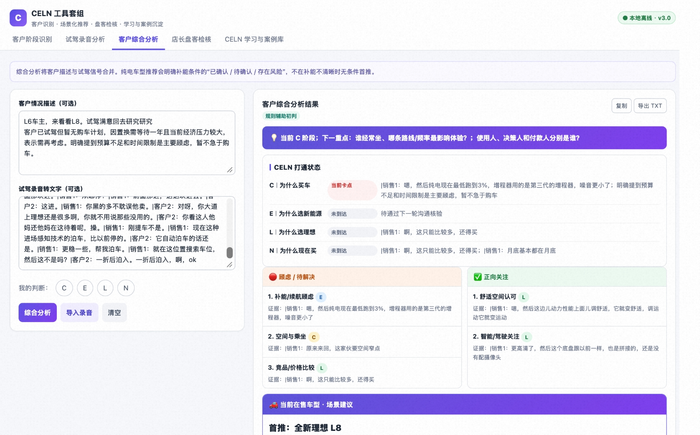
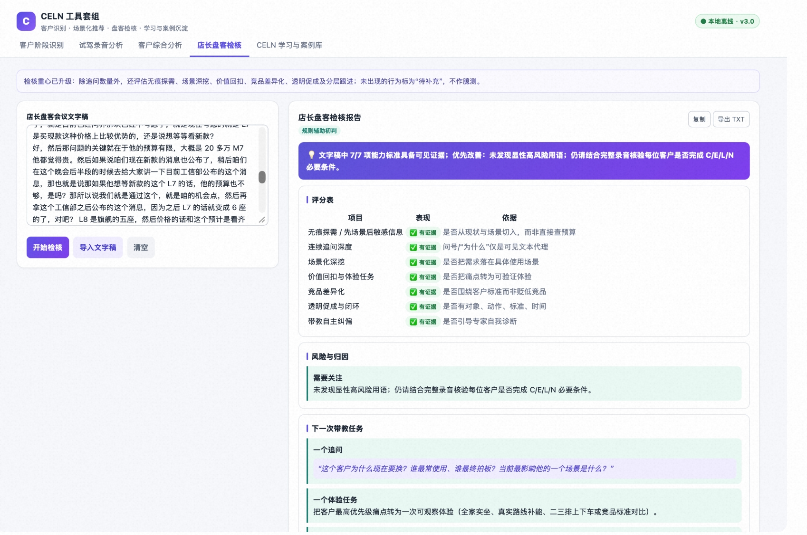
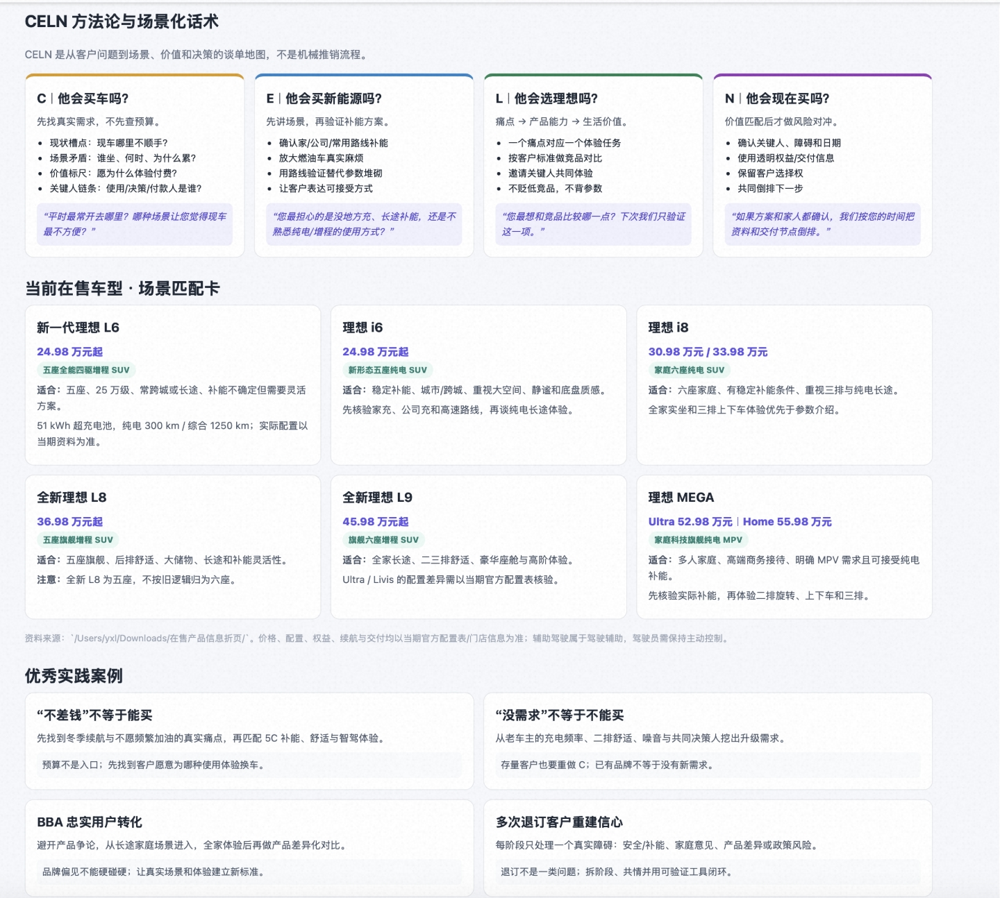

# 理想汽车：门店客户意向分析与推进助手

> 收录日期 2026-09-30 · 来源：内部技术社区文章（作者：刘宇轩，Level 1，销售，2026-08-10，板块：工具分享，105 阅读）
>
> **一句话**：把销售方法论 CELN（C-为什么买车 / E-为什么选新能源 / L-为什么选理想 / N-为什么现在买）做成知识库，配上理想全系车型参数库，输入客户描述或试驾录音，本地 Web 应用（调用本地 Claude CLI，数据不出门店）秒级输出：CELN 阶段判断 + **对专家自判的校验** + 卡点根因 + 可执行推进话术 + 车型推荐（含明确不推荐）；还能反过来检核店长盘客会议质量、沉淀案例库。**十个案例中第一个销售域案例——方法论框架 + AI 判定的模式从工程域平移到了最"软"的零售场景；"AI 校验人的判断 + AI 评估人的会议"是把案例二"反向诊断"从流程资产延伸到了人的工作质量。**
>
> **顾问点评**：本地 Claude CLI 推理、数据不出门店是销售数据合规的正确解法；"AI 校验销售的自判 + AI 给店长盘客会议打分"让这个工具从效率工具升格为**组织能力建设工具**——它在训练人而不只是替代查询；案例库自助贡献设计了知识飞轮雏形。三个待补点：其一，**单门店孤岛**——案例库、话术库、打分基线都在门店内，好经验无法跨店复制，而 CELN 方法论的价值恰恰在于横向比较（同样的卡点哪家店解得最好）；其二，**CELN 判定的预测效度未验证**——判定为"高意向"的客户实际成交率有没有显著差异？没有效度验证的方法论数字化只是把主观判断搬进了系统；其三，录音质量参差（方言、噪音、销售引导性提问）对判定稳定性的影响未讨论。**建议打通**：案例库跨门店联邦共享（脱敏 + 带来源标注，参照案例十四的责任田 + 来源机制）；与 CRM / 成交数据回连做判定效度的季度校准；打分结果接门店培训体系形成"判定 → 培训 → 复测"闭环。

---

## 1. 案例来源与背景

- 来源：公司内部技术社区文章，作者刘宇轩（Level 1 新手入学，**销售**），2026-08-10，阅读量约 105；
- 工具形态：本地 Web 应用（Python HTTP Server + 纯 HTML/CSS/JS，一键脚本启动）；
- 业务域：零售门店 · 客户意向判断与推进（此前九个案例全部来自研发/制造/供应链，这是第一个门店销售域）；
- 痛点：
  - **阶段判断主观性强**：专家对同一客户的 CELN 阶段判断差异大，容易"跳阶"推进，转化效率低；
  - 试驾录音内容量大，人工复盘效率低，关键顾虑点和转化信号易遗漏；
  - 推进建议泛化（"继续跟进""等客户消化"），缺可执行话术；
  - 车型推荐依赖个人经验，参差不齐导致推荐错位。

---

## 2. 解决什么问题

对情况不明朗的客户，店长如何在自我感知之外，快速准确判断购买意向层级、在恰当时机采取正确推进动作、综合分析该推荐什么车型。

核心命题：**把"专家各自凭感觉判断"变成"按 CELN 框架统一判断 + AI 校验"。**

---

## 3. 任务流拆解

### 3.1 五个功能模块

```text
模块一：客户阶段识别
  输入：自然语言客户描述
  输出：CELN 阶段及各阶段通过状态
       + 用户自判阶段准确性校验（准确 / 存在偏差 / 有误）
       + 卡点真因分析（根因层面，非"某阶段未打通"的表面描述）
       + 今天/明天可执行的 1-2 个具体动作 + 参考话术

模块二：试驾录音分析
  输入：录音转文字（任意长度）
  输出：Top 3 顾虑点（含 CELN 阶段归因、重要程度）
       + Top 3 关注点（含正向信号）
       + 推荐车型和配置（首推 + 备选 + 明确不推荐）
       + 一句话概括试驾后整体状态

模块三：综合分析（核心）
  输入：客户描述（可选）+ 试驾录音（可选）+ 自判阶段（可选）
  输出：融合判断 + 顾虑点/关注点双栏并排 + 精准车型推荐（含卖点、顾虑回应）+ 推进动作与话术

模块四：店长盘客检核
  输入：盘客会议录音转文字稿
  输出：结构化检核报告——逐客户分析追问深度、阶段判断准确性、建议可执行性，按维度评分

模块五：CELN 学习与案例库
  用户可自助添加做得好的案例，"方便后续整理方法论和分享"
```

### 3.2 典型任务流

```text
试驾结束 → 录音转文字 → 模块二/三分析
  → 顾虑点归因到 CELN 阶段（如"续航焦虑 → E 阶段未打通"）
  → 车型推荐（首推+备选+不推荐，含对顾虑的回应话术）
  → 今天/明天的具体动作
店长盘客会 → 会议录音 → 模块四检核
  → 对每个客户评估专家的追问深度/判断准确性/建议可执行性
好案例 → 模块五入库 → 方法论持续迭代
```

---

## 4. 用到的能力

- **本地 Claude CLI 作为推理后端**：无需 API Key，数据不上传，全程本地运行；
- CELN 方法论完整规则知识库（内置）；
- 理想全系车型参数库（L6/L7/L8/L9 全新/MEGA）；
- 长文本分析（试驾录音转写、会议转写）；
- 结构化输出（阶段判断、双栏顾虑/关注点、维度评分）；
- 前端纯 HTML/CSS/JS，无框架依赖，开箱即用。

**部署形态的关键约束：数据安全——客户信息不外传。**这是该工具选择本地 CLI 方案的根本原因。

---

## 5. 效果与证据

- 文章给出功能描述和界面截图（原文含图）；
- **无任何量化数据**：没有转化率变化、判断一致性提升、复盘时长节省、使用门店数；
- 效果主张停留在"秒级输出""安全可控"的功能层面。

---

## 6. 可信度判断

**判断：工具真实存在（截图 + 模块细节完整），落地深度未知，文章是产品介绍文体。**

可信的部分：

- CELN 痛点描述真实且有深度："跳阶推进"是销售漏斗管理的真实通病；"推进建议停留在'继续跟进''等客户消化'"的泛化批评说明作者真懂一线；
- 功能结构设计成熟：五个模块覆盖了"判断 → 校验 → 分析 → 检核 → 沉淀"完整闭环，特别是模块四（检核人）和模块五（案例库）不是拍脑袋能设计出来的；
- "明确不推荐"车型这一细节反常识但合理——好的推荐工具要敢说不，这通常是真做过的设计；
- 本地 CLI + 数据不出门店的技术选型与销售客户数据的敏感性匹配。

需要保留的部分：

- 无任何使用量和效果数据；
- **核心前提未验证**：AI 的 CELN 阶段判断是否真的比专家自判更准？文章假设了这一点但没有证据（校验输出"准确/偏差/有误"以谁为基准？）；
- 知识库维护未说明：车型参数随年款更新、CELN 规则随方法论迭代，谁维护、多久更新；
- LLM 判断销售场景的稳定性：同一客户描述两次输入，阶段判断是否一致（主观域的复现性问题）。

结论：**方向真实、设计完整；效果与判断准确性均未验证，可信度档位与案例九相同——真实存在、深度未知。**

---

## 7. 对我们当前项目的启发

### 7.1 框架化 + AI 判定的模式平移到了最软的域（模式通用性的关键证据）

CELN 与前九个案例的判定框架对照：

| 域 | 框架 | 判定对象 | 人的问题 |
|---|---|---|---|
| EHS（案例三） | PRA 五步法 | 风险情景 | 讨论聚焦跑偏、覆盖不全 |
| 采购（案例九） | 四象限 + 阈值法 | 品类定位 | 判断口径不一 |
| **销售（本案例）** | **CELN 四阶段** | **客户意向阶段** | **主观性强、跳阶推进** |
| 芯片质量（12 系列） | 失效分类 + 分层标准 | 良率/失效模式 | 经验判断漂移 |

四个域、同一结构：**专家判断不一致的地方，把判定逻辑框架化，再让 AI 按框架执行并校验人的判断**。这是继"物种选型判据"之后第二个可写进 insights 的跨案例收敛判断——销售这种最依赖个人感觉的域都能框架化，说明该模式的适用边界比想象宽。对应 12 系列：失效分析/异常判定的口径统一，走的是同一条路。

### 7.2 AI 校验人的判断 + 评估人的会议：反向诊断延伸到人（对应案例二）

模块一的"自判阶段准确性校验"和模块四的"盘客会议按维度评分"，把"AI 审视对象"又推进了一层：

```text
案例二：  AI 诊断流程资产（制度本身）
案例三：  AI 出初稿，人校准 AI
本案例：  AI 校准人的判断 + 给人的会议质量打分
```

至此"AI 与人互审"形成完整双向结构。对 04-05 的启示：任务闭环里的 `human_decision` 和 `expert_correction` 字段不止用于人纠 AI，**也应支持 AI 纠人**（对专家判断做一致性校验、对会议产出做可执行性评分）——这是组织能力管理（L9 经营归因层）的入口：从"任务做没做对"到"人有没有按方法论做"。

### 7.3 本地 CLI 推理：敏感数据场景的最务实接入（新部署模式）

十个案例中出现的第一种"数据不出域"方案：不调云 API、不申请企业 API 权限，直接用本地已装的 Claude CLI 做推理后端，Python HTTP Server 起个壳。

- 适用判据：**数据敏感（客户信息）+ 单门店小规模 + 使用者无开发资源**；
- 代价：无集中治理、无统一评测、知识库各自维护——这正是 04-06 里 L1（模型网关）和 L5（治理评测）要解决的问题。可以预判：这类"门店级本地工具"会大量出现，最后要么收编进企业网关（统一模型接入 + 评测），要么变成治理盲区。**这是 L1/L5 层需求自下而上的真实信号。**

### 7.4 模块五案例库：经验→资产第五个样本，且首次开放自助贡献

```text
LI-PAS → 流程库 → EHS → DebugForge → 本案例（用户自助添加好案例）
```

本案例的增量：案例库不只系统回写，**用户可以主动贡献"做得好"的案例**——众包式方法论迭代。这与 04-05 的专家修正数据回流是同一资产管道，但贡献动机设计（销售愿意录案例吗、录的案例质量谁把关）是零售域特有的难点，值得后续追问。

### 7.5 输出设计的三个好细节

1. **卡点真因分析**（根因层面，非"某阶段未打通"的表面描述）——拒绝表面归因，和 EHS 案例的"不是结论而是证据链"同一追求；
2. **明确不推荐**——推荐系统敢输出负向结论，避免"全都推荐"的信息噪音；
3. **动作限定"今天/明天"+ 参考话术**——建议带时间窗和可直接使用的语言，可执行性落到了地面（对比痛点里"继续跟进"的泛化表述）。

### 7.6 最值得抄的设计

1. CELN 四阶段作为判断框架 + 通过状态 + 卡点归因的输出结构——任何漏斗型业务（招聘 pipeline、商机推进、项目阶段评审）可直接套用；
2. "自判 → 校验"双输入设计：让用户先自己判断再让 AI 校验，既收集了人的判断数据（校验基准），又强化了方法论训练；
3. 模块四的检核维度（追问深度/判断准确性/建议可执行性）——评估"分析会议质量"的可复用维度模板；
4. 本地 CLI + 零依赖前端的分发方式：一个启动脚本开箱即用，门店环境零 IT 支持；
5. 五模块覆盖"判断→校验→分析→检核→沉淀"闭环——工具设计先画闭环再填功能。

---

## 8. 后续想实测 / 追问的问题

- **校验基准问题**：模块一输出"准确/偏差/有误"以什么为标准（多数专家共识？成交结果回溯？）——没有基准的校验是循环论证；
- AI 判断与最终成交结果的相关性验证：用历史客户数据回测，AI 阶段判断 vs 专家自判谁更预测成交；
- 同一录音多次分析的判断一致性（主观域复现性）；
- 知识库维护：车型年款更新、CELN 规则迭代的更新机制，各门店版本是否统一；
- 使用规模：多少门店在用，模块四（检核）专家接受度如何——被 AI 打分的感受问题；
- 案例库的输入质量：自助贡献案例有没有结构化模板和质量把关；
- 隐私边界：录音转写在哪做的（本地还是云端 ASR）、转写文本留存多久——"数据不出门店"是否覆盖全链路。

---

## 附：原文截图

> 以下为原文中的工具界面截图（收录时由读者粘贴，未做内容核对，仅作界面形态参考）。






