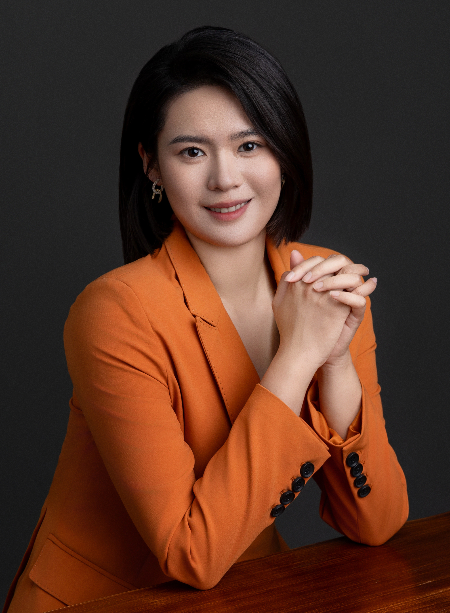

# 李嘉怡

> 理想汽车 工业AI算法团队负责人（职级17级）｜ 佐治亚理工硕士 ｜ 6年智能制造全链路实战
>
> 致力于以前瞻视野与实战经验，推动人工智能技术与实体工业深度融合，践行国家"智能制造"与"数字中国"战略。

---

## 基本信息

| | |
|---|---|
| **姓名** | 李嘉怡 |
| **出生年月** | 1995年3月 |
| **国籍** | 中国 |
| **政治面貌** | 群众 |
| **学历学位** | 硕士研究生（Georgia Institute of Technology，电子工程与计算机科学，US News工科全美Top 5） |
| **英语水平** | 美国本硕6年，可无障碍进行英文技术文献阅读、学术交流与技术报告撰写 |
| **现任职务** | 理想汽车 智能工业部 算法团队负责人（2020.06–至今） |
| **现居地** | 北京·海淀 |

---

## 教育背景

| 时间 | 学校 | 专业 / 学位 | 成绩 |
|------|------|------------|------|
| 2016.08–2018.05 | Georgia Institute of Technology（佐治亚理工学院，QS世界排名前100 / 美国工科前5） | 电子与计算机工程 · 硕士 | GPA 3.80/4.00 |
| 2013.08–2016.05 | Georgia Institute of Technology（佐治亚理工学院） | 电子与计算机工程 · 学士 | GPA 3.94/4.00 |

- **硕士主修**：机器学习、模式识别、数据分析与可视化、数据库基础、计算机架构、无线电通信
- **学士主修**：信号处理、系统与控制、电子电路设计

---

## 自我评价

理想汽车智能工业部初创成员，现任算法团队负责人，带领13人团队（规模最多时20人），完整参与并推动了部门从"研发数据分析"到"工业智能全产业链服务"的转型。作为多个从0到1项目的发起人与负责人，独立完成了从需求策划、立项、团队组建、技术攻坚到客户对接、落地运营与收益核算的全链路工作，擅长将大模型与AI智能体技术组织成可交付、可复制、可算账的产品与解决方案，并推动其在跨部门、跨企业的场景中真正落地见效。2025年，团队交付的AI应用为公司创造经营价值约3.77亿元（经公司经营管理口径核算），相关工业智能产品已在德赛、星宇、威迈斯等多家核心供应商落地应用。

---

## 专业技能

| 维度 | 掌握程度与说明 |
|------|----------------|
| **AI智能体与大模型应用** | 精通。大模型智能体（Agent）系统架构设计、BPMN流程编排、Tool Use工具调用、RAG检索增强、Prompt工程；熟悉Transformer架构原理及主流大模型的应用集成与场景落地 |
| **知识工程与本体建模** | 精通。OWL本体建模（TBox/ABox）、知识图谱构建、Apache AGE图数据库、领域知识蒸馏与结构化 |
| **机器学习与异常检测算法** | 精通。时序/波形异常检测（FFT/DTW/包络线）、统计过程控制（SPC/Nelson Rules/Cp-Cpk）、Box-Cox变换、趋势归因决策树 |
| **大规模数据治理** | 精通。工业数据采集清洗标注策略、实时流处理（Kafka CDC）、消息队列（pgmq）、事件驱动架构、多模态数据（曲线/图像/音频）处理 |
| **编程语言** | Python（精通，主力开发语言）；SQL（精通）；具备快速学习新语言与技术栈的能力 |
| **深度学习框架** | PyTorch（应用层使用经验，用于模型调优与部署）；侧重模型的工程化落地而非从零训练 |
| **工程与平台** | FastAPI、PostgreSQL、Docker、微服务部署（PaaS）、React（数据可视化） |
| **熟悉工业领域** | 离散制造、供应链质量管理、过程工业等场景的工艺机理与数字化转型路径 |
| **语言能力** | 英语（美国本硕6年，可无障碍进行技术文献阅读、学术交流与英文报告撰写） |

---

## 工作经历与产品矩阵

### 理想汽车 · 智能工业部 ｜ AI Product Engineer / 算法团队负责人（2020.06–至今）

作为部门初创成员与算法团队负责人，领导13人团队（峰值20人），主导连山工业智能产品矩阵的**规划立项、团队组建、研发交付与客户经营落地**全流程：

| 层级 | 产品 | 定位 |
|------|------|------|
| 底座 | 连山数据智能底座 **dsinfra** | 数据智能计算与治理底座 |
| 算力 | **AiStation / AiBrain** | 边缘与中心算力硬件 |
| 平台 | 连山数据科学工作台 **dsbase** | 算法开发与交付工作台 |
| 应用 | 连山工业智能体 **dsclaw** | 面向业务场景的工业智能体 |

上述矩阵之上运行自主设计的 **Oneday智能体框架**，已在**德赛、星宇、威迈斯等多家核心供应商完成落地部署**，推动连山工业AI从"内部研发验证"走向"面向外部客户的规模化商业交付"。

围绕产品矩阵，设计并上线了面向制造质量与供应链场景的辅助决策与告警系统，覆盖三类工程应用模式：
- **H2A（Human to Agent）**——偏感知计算，为一线人员提供实时质量监控与风险告警；
- **E2A（Expert to Agent）**——偏分析诊断，将专家经验蒸馏为可复用的智能体诊断能力；
- **A2A（Agent to Agent）**——偏流程协同，实现多智能体在跨系统、跨环节的自主协作。

在项目策划立项、团队组建、跨部门与客户对接、经营价值核算等环节承担核心角色，2025年主导的AI应用为公司创造经营价值约**3.77亿元**（经公司经营管理口径核算）。

---

## 核心项目业绩

### 一、AI诊断智能体 + SPC统计过程控制系统

> **角色**：项目负责人 / 架构设计　**周期**：2025.06–至今　**状态**：生产运行中

**项目背景与个人职责**：针对生产过程中趋势异常发现滞后、返修成本高、根因分析涉及人机料法环多因素而耗时长的痛点，发起并主导公司首个覆盖"感知—诊断—决策—跟踪"全流程的工业AI智能体项目，牵头协调工艺、质量、IT多部门，从立项到生产上线全程负责。

**技术方案（要点）**：SPC引擎对焊装、涂胶工艺关键参数做7×24实时监控，通过CPK趋势检测较人工巡检提前2至4小时预警；异常触发后自动启动基于BPMN流程引擎的五阶段诊断智能体，并以OWL本体知识图谱与多数据源自动调用支撑诊断推理与持续迭代。

**经营价值与成果**：牵头建立AI价值量化体系（EVI），将每次异常检出折算为可核算的经济收益，使AI成果能以经营指标向管理层和客户直接呈现，也为团队争取资源提供了量化依据。系统覆盖3个工艺域、数千个监控窗口，试点场景根因定位准确率超75%，人工介入时间降低约60%。

---

### 二、焊接曲线实时判异系统

> **角色**：技术负责人　**周期**：2025.12–至今　**状态**：生产运行中

**项目背景与个人职责**：针对工艺工程师提出的"国产焊装设备自带判异能力不足、漏检渐变型缺陷"的实际问题，牵头组建项目小组，负责方案设计、任务拆分与研发排期，并对接现场工艺与设备团队完成部署上线，用一套独立于设备自检的算法系统补齐质量监控短板。

**技术方案**：设计六路并行独立检测器（包络线偏离 / 频域相似度 / 导数突变 / 动态时间弯曲 / 炸点与飞溅极值检测），各检测器独立判级、取最高等级为最终结论；标准曲线按设备、焊点、脉冲段数、曲线长度四维分桶并每小时自适应重训。

**运行规模与成效**：覆盖298台焊接设备、4,913个焊点，日均实时处理曲线数十万条，单条推理低于10毫秒；判异准确率95%，可补充检出设备自检未能识别的渐变型异常；每车间日均拦截风险焊点30个以上，将缺陷遏制在产线环节，避免流入后道工序造成更高的返修与召回成本。

---

### 三、供应链质量预警体系"云链"（获理想汽车年度"磐石奖"）

> **角色**：项目发起人 / 架构设计与运营负责人　**周期**：2022–2024

**项目背景与个人角色**：为将质量风险拦截在供应商源头、避免缺陷件流入整车产线乃至终端客户造成更大损失，牵头构建贯穿理想汽车与56家核心供应商的供应链数据预警体系，覆盖46,000余个关键工艺点位，部署89个边缘算力节点处理曲线、图像、音频等多模态过程数据。从立项、供应商谈判、架构设计到长期运营全程负责，并推动其中部分供应商转化为连山产品的深度用户，实现从质量协同到商业落地的延伸。

**业务价值（2025年度）**：累计提前发现并拦截风险事件6,379次，为理想汽车及供应商伙伴共同避免质量成本与效率损失约**3.77亿元**（经公司经营管理口径核算）。技术落地的唯一检验标准是业务价值，每一笔收益背后都有真实的风险拦截案例：

- **电驱功率模块芯片级缺陷拦截**：针对理想汽车首发的全栈自研电驱，牵头联合电驱研发团队与工艺专家攻关，从试产阶段老化曲线中识别功率模块芯片级缺陷。2025年Q4上线后拦截风险件1,371件，为1,000余位i6/i8车主规避了行车安全风险。
- **末次合格率异常告警**：通过产品末次合格率监控，识别出供应商（华工高理）生产WPTC加热器时功率测试程序的错误使用，将风险快速遏制在出厂之前。
- **跨系统风险件实时围堵**：早期风险件前馈围堵涉及多个业务系统与角色，某供应商（巨一）29台壳体泄漏电驱风险件的围堵前后耗时7天、仅11台成功拦截。我复盘后判断"靠人力协调不可持续"，牵头协同连山团队与企业智能部门横跨3个业务系统拉通全环节实时数据，使每个风险件位置秒级可视，显著提升围堵时效。该方案在后续德赛中控屏围堵行动中实战应用，**获得业务侧高度认可**。

**荣誉说明**："磐石奖"为理想汽车供应链领域最高集体荣誉（等同公司级重大贡献奖励），全公司每年仅数个团队获此殊荣。该项目最大挑战不在技术，而在**跨组织协同**——面对56家认知水平参差的供应商，采取"以确定性价值建立信任"的推进策略，推动双方从"谈判桌两端的博弈"转向"面向共同成本优化与效率提升"的供应链协作新范式。

---

## 技术方法论：连山Oneday工业智能体框架

上述项目均运行于本人主导参与建设的Oneday框架（连山数据科学计算底座）之上。推动这套框架，本质上是把团队的工作方式从"接一个项目、做一套系统"转变为"沉淀一套产品、快速复制到多个场景"。

**解决的核心痛点**：框架建立前，团队更接近算法外包模式，每个项目从零开发，一套质量预警系统的开发部署周期约6个月。建立统一架构后，能力沉淀为可复用产品，新场景上线的工作重心从重复开发转变为数据对接与参数调整，横向复制周期缩短至**1至2个月**，且产品可持续迭代打磨，而非每次推倒重来。

**设计要点**：通过冷热路径分离（算法交付与运行态推理解耦）、能力标准化装配、四层结构化验收、本体驱动的知识管理，实现工艺知识变更无需改代码、只需更新配置，大幅降低复制与维护成本。

**规模化验证**：框架不仅支撑理想汽车内部多个工厂的应用，还已对外落地**超过10家外部供应商企业**，验证了跨组织、跨场景的可复制能力——这也是从"技术项目"走向"产品经营"的关键一步。

---

## 团队管理与人才培养

作为团队负责人，除主导上述核心项目外，还负责预测性维护、智能排产、售后诊断智能体等多个技术方向的选型决策、资源分配与投入产出评估。

**团队与梯队**：直接管理13人技术团队（峰值20人），下设3个技术小组，覆盖时序分析、备件预测、智能排产、图像检测等方向；将多名校招应届生培养为4级部门组长，形成稳定的人才梯队。面向工业AI"市场无对口专业"的现实，设计"实战+认知"双驱动培养路径，帮助新人快速建立对工业复杂性的理解与对AI工具的驾驭力。

**管理理念**：坚持"提升团队定义正确问题的能力"重于"监督执行"。常态化组织内部前沿分享，内容覆盖标杆企业实践（特斯拉供应链、丰田生产系统等）、工业机理与质量体系（APQP/PFMEA、NVH、三电系统等）、AI前沿与跨界思维，持续拓宽团队视野、对齐认知。

**技术资产**：牵头完成多项发明专利申请，包括《悬置动刚度曲线仿真方法》（CN 118673651 A，已进入实审）、《压装异常检测方法及模型训练方法》（初审合格）。

---

## 早期工作经历

### 中信云网 ｜ 算法工程师（过程工业AI方向）

- **化工厂巡检仪表识别**：应用深度学习神经网络分析化工厂机器人巡检视频，自动定位画面中的仪表盘并识别读数，仪表定位率达95%、读数准确率达85%。
- **污水处理曝气优化**：分析污水处理厂曝气流程的水质、水量、溶解氧等多维监测数据，优化鼓风机控制逻辑，独立完成从理论研究、建模、实地部署到运行监测的全过程，曝气池溶解氧维持在目标区间的时长占比超过90%。

---

## 个人特质

- **责任心强、抗高压**：作为一名母亲，深知复杂任务管理对责任心、优先级判断与时间效率的要求；习惯在高不确定性、紧交付节点下稳定输出、扛住责任。
- **能带队、能攻坚**：既能在关键技术难题上顶到一线，也能把不同专业背景的成员拧成一股绳，从技术骨干成长为团队负责人。
- **乐于思考、勇于变革**：习惯从问题本质出发做判断，曾推动团队将系统架构从硬编码逻辑转向本体论建模，啃下别人绕开的硬骨头；从数据分析到供应链质量、再到AI智能体，每次跨领域转型都能快速学习、快速上手，对AI前沿技术保持敏感。
- **跨文化沟通**：具备海外求学与国内央企、民企、供应商多方协同经验，能在不同组织语境中清晰沟通、推进落地。
- **跨文化沟通**：具备海外求学与国内央企、民企、供应商多方协同经验，能在不同组织语境中清晰沟通、推进落地。
